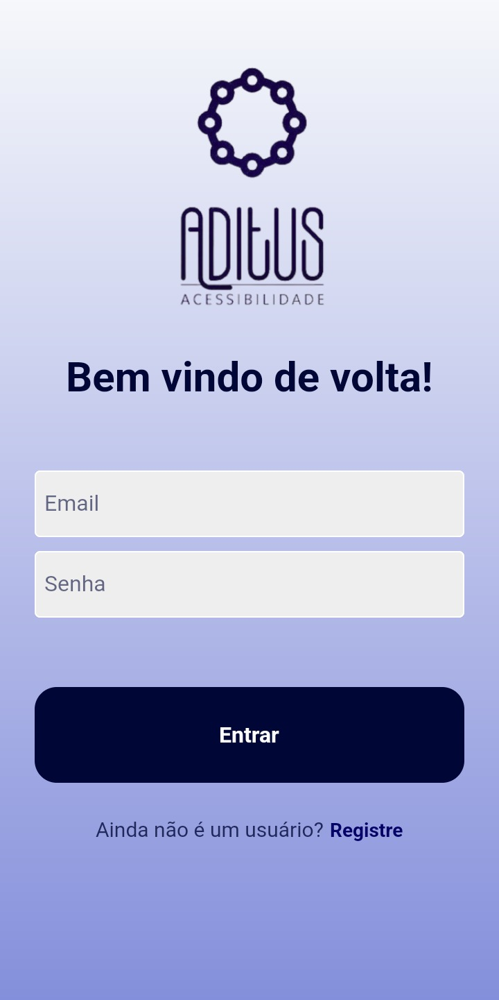
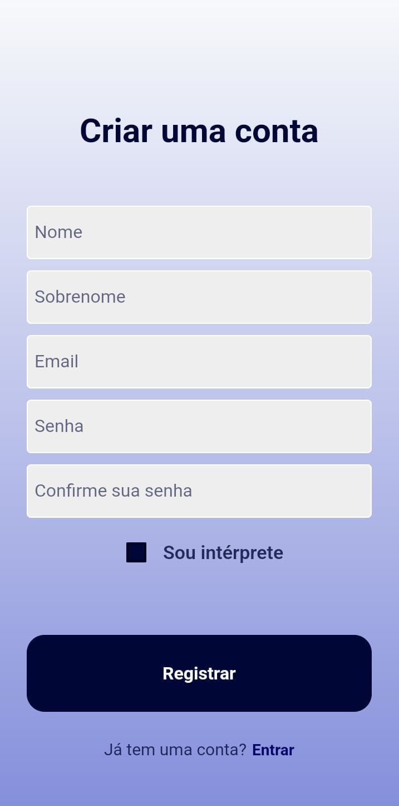
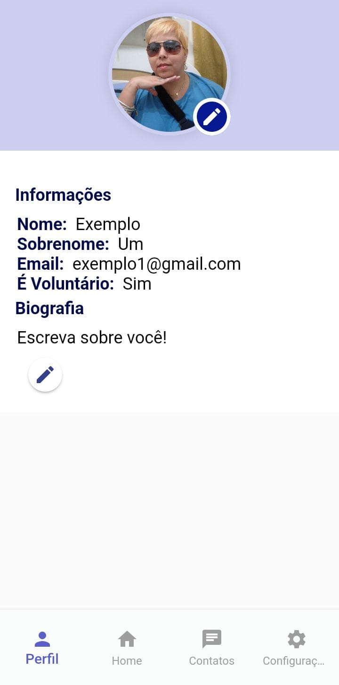
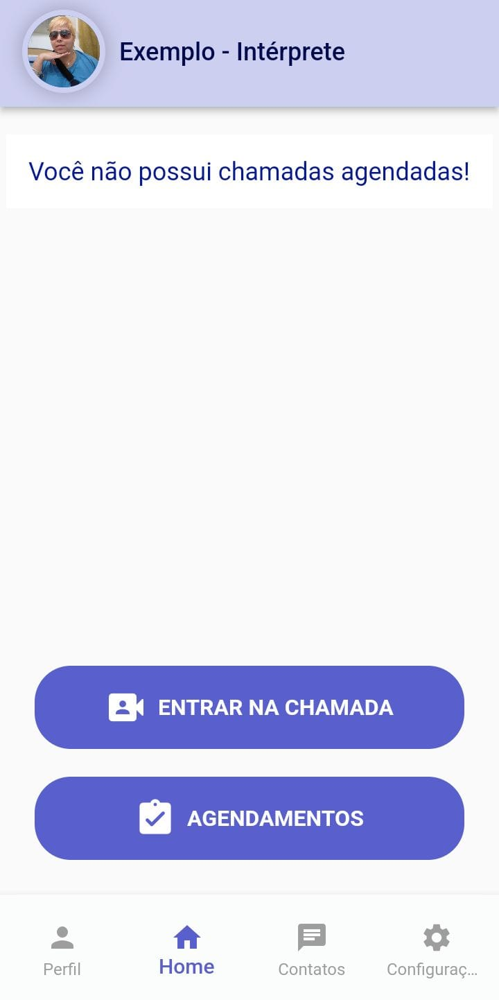
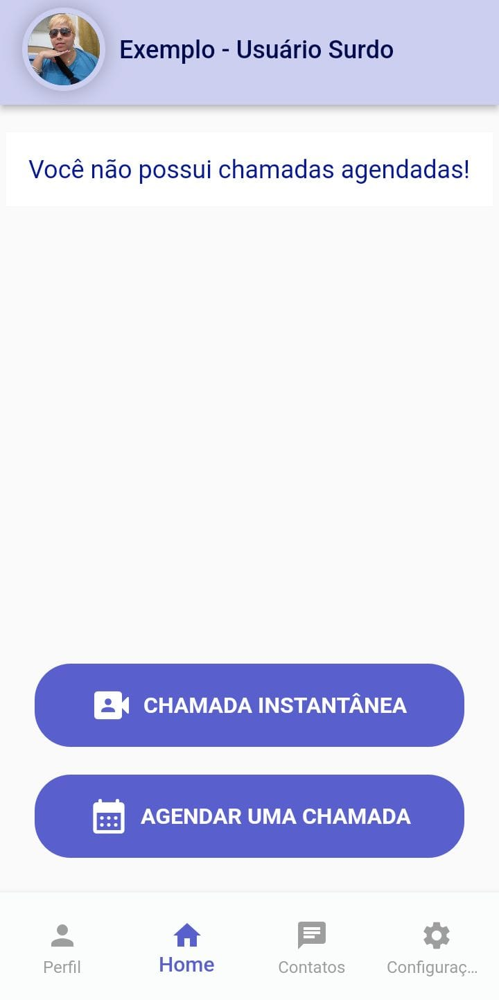
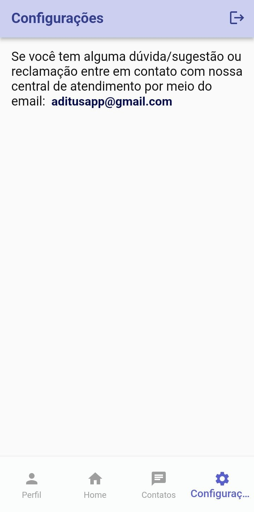
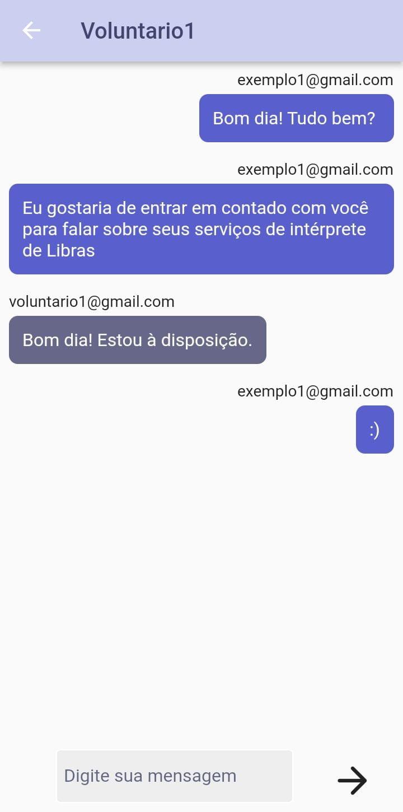

# Aditus Acessibilidade
Projeto feito em Flutter juntamente com @Nicolle-Oliveira, @AnnyACAM e @beacms - Orientadora Vírginia Mota

## O que é?

O aplicativo Aditus está sendo desenvolvido para combater a exclusão social de pessoas com deficiência auditiva no Brasil. Ele permite que os usuários surdos iniciem videochamadas com voluntários intérpretes ou agendem chamadas programadas. O aplicativo prioriza intérpretes e usuários da mesma região para reduzir diferenças linguísticas, e se não houver intérpretes disponíveis na região, a chamada é encaminhada para outras áreas. Intérpretes registrados são notificados sobre chamadas e decidem se desejam participar. Eles auxiliam na comunicação entre surdos e ouvintes durante as chamadas. Também temos como objetivo incentivar o estudo da Língua Brasileira de Sinais.	  

